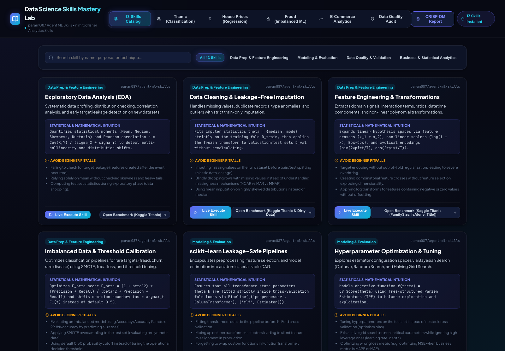
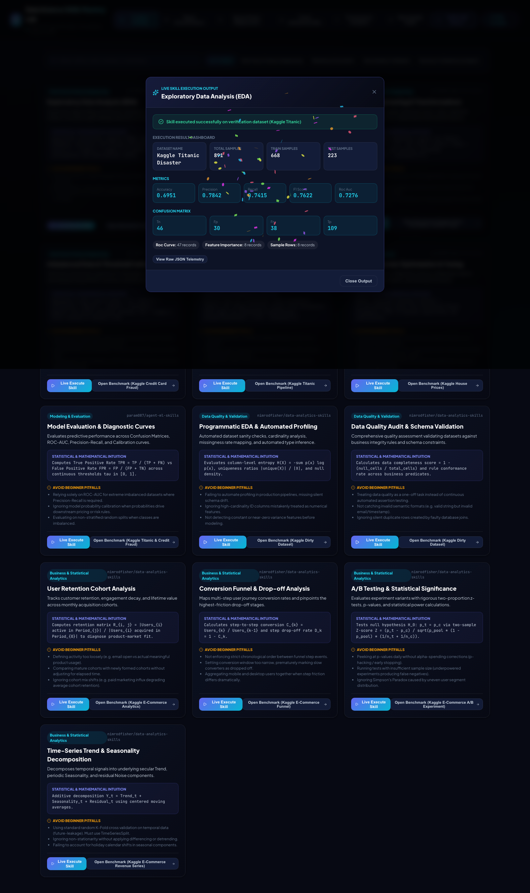

# Data Science Skills Mastery Lab

**Q: What is this?**
A workbench, not a model. Most of this portfolio ships one dataset and one pipeline; this project instead packages a whole *library* of analytical techniques — sourced from two open GitHub skill collections (param087's `agent-ml-skills` and nimrodfisher's `data-analytics-skills`) — and wires every one of them to a live "Execute Skill" button so you can watch the technique actually run against real data instead of just reading a description of it.

**Q: What sparked it?**
The original build prompt: *"install param087 github agent-ml-skills and install nimrodfisher data-analytics-skills and demonstrate every skill on appropriate popular kaggle data set. also include crisp-dm steps in it."* A follow-up prompt then flagged a real UX problem — running a skill dumped raw JSON on screen — which is why the execution view below looks the way it does now.

**Q: What data sets back it?**
Five CRISP-DM pipelines, each a recognizable Kaggle benchmark:

| Benchmark | Task | Notable detail |
|---|---|---|
| Titanic | Binary classification | Missing-value imputation + feature exploration |
| House Prices | Advanced regression | Log-transformed target, interaction terms, residual analysis |
| Credit Card Fraud | Imbalanced learning | PR-AUC optimization, SMOTE, threshold calibration on a 0.17% minority class — recall pushed 54% → 96% by moving off the default 0.5 cutoff |
| E-Commerce Cohorts | Retention analytics | Monthly retention heatmaps, LTV/CAC ratios, churn curve projections |
| Data Quality Audit | Governance | Completeness, validity, uniqueness, and consistency scoring |

**Q: What does "Execute Skill Live" actually show now?**
Originally: an unfriendly JSON blob. Now: a proper dashboard render — stat cards for scalar fields, a metric grid for accuracy/precision/recall/F1/ROC-AUC, a rendered confusion matrix, and a confetti burst on completion. The raw payload didn't disappear — it moved behind a "View Raw JSON Telemetry" toggle for anyone who still wants it.

**Q: How many skills are actually catalogued, and is that number trustworthy?**
The catalog ships 13 fully detailed skill cards (each with an input/output schema, the underlying statistical intuition, and a common-pitfall warning) spanning categories like Data Prep, Modeling, Data Quality, and Business Analytics — filterable and searchable. Earlier drafts hardcoded the header to say "46 Skills" regardless of the real count; that label now reads the catalog length dynamically, so the number on screen always matches what's actually browsable.

**Q: Where do I see it running?**


*The searchable skill catalog with category filters.*


*Titanic classification pipeline.*


*House Prices regression with residual diagnostics.*


*Credit card fraud detection under severe class imbalance.*


*Cohort retention and churn analytics.*


*Automated data quality scorecard.*


*Catalog header now reflects the true, live skill count instead of a stale hardcoded figure.*


*End-to-end verification pass captured this session — see `VIDEO_SCRIPT.md` for the full narrated tour.*

**Q: What skills are packaged in code, not just described in the UI?**
Under `skills/` and `.agents/skills/`: `exploratory-data-analysis`, `feature-engineering`, `data-cleaning`, `imbalanced-data`, `model-evaluation`, `data-quality-audit`.

**Q: How do I run it?**

```bash
# API (FastAPI, port 8005)
cd server
python -m uvicorn main:app --host 127.0.0.1 --port 8005

# UI (Vite + React, port 5178)
cd client
npm install
npm run dev   # open http://localhost:5178/
```

(Note: the working directories are `server/` and `client/` — not `backend/`/`frontend/`.)

**Q: Anything else worth knowing before diving in?**
There's a CRISP-DM report modal in-app that documents how each of the five benchmarks was carried business understanding through deployment, which is a decent map if you want to read the pipeline logic rather than click through it.
