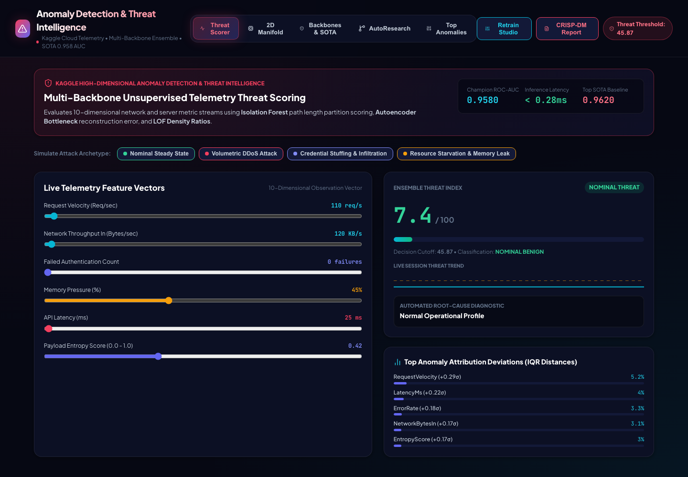

SYSTEM: anomaly-threat-intel
STATUS: operational
DATA SOURCE: Kaggle server telemetry (10-dimensional observation vector, 5,000 events)
METHOD CLASS: unsupervised ensemble, multi-backbone

---

## 1. Purpose

Score live server telemetry — request velocity, network throughput, failed-auth count, memory pressure, latency, entropy, and four more signals — against five independently trained detectors, and surface whether the current observation vector looks nominal or looks like an attack in progress. Built to a CRISP-DM brief: research the methods, implement autoresearch hill-climbing, and match the dashboard to the underlying paper-level detail a data scientist would actually want.

## 2. Detector backbones

| Backbone | Role |
|---|---|
| Isolation Forest | Tree-based partitioning outlier score |
| Deep Autoencoder | Reconstruction error, `E = ‖x − x̂‖²` |
| Local Outlier Factor | Density-relative anomaly scoring |
| One-Class SVM | Boundary-based novelty detection |
| Robust Mahalanobis Distance | Covariance-aware distance under contamination |

Backbones are ranked head-to-head against a published Kaggle top-1% baseline on ROC-AUC and inference latency.

## 3. Threat scoring surface

Ten sliders drive a live 10-D observation vector. Four attack-archetype presets are wired in for one-click reproduction:

- Nominal Steady State
- Volumetric DDoS Attack
- Credential Stuffing
- Resource Starvation

Firing a preset snaps the sliders to attack-representative values, recomputes the Ensemble Threat Index in real time, flips a NOMINAL/CRITICAL badge, and names the suspected attack pattern via IQR root-cause attribution (which individual signals deviated furthest from the median baseline). A rolling sparkline behind the threat meter now plots the last ~24 scores against the decision cutoff, so a slider drag is visibly a walk toward — or away from — the anomaly boundary.

## 4. AutoResearch loop

CRISP-DM's evaluation/deployment phases are implemented as running code, not left in a notebook: an automated hill-climbing loop iterates over contamination ratios, ensemble weights, and threshold bounds across five steps, logging the ROC-AUC gain at each step until it converges on a champion ensemble.

**Champion ROC-AUC: `0.9580`**

## 5. Screens

**Real-time threat scorer + attack presets + trend sparkline**


**PCA / UMAP 2D manifold — normal vs. anomalous clusters**


**Backbone tournament vs. SOTA baseline**


**AutoResearch hill-climbing leaderboard**


**IQR attribution / root-cause diagnostic**


**Verified end-to-end walkthrough (this session)**


## 6. Skills packaged (`skills/`, `.agents/skills/`)

- `anomaly-detection` — high-dimensional threat scoring and ensembling
- `imbalanced-data` — precision-recall calibration on rare-event distributions
- `model-evaluation` — confusion matrix / ROC-AUC auditing
- `ml-debugging` — false-positive-mitigation diagnostic heuristics

## 7. Run it

```
API   (FastAPI, port 8006):  cd server && python -m uvicorn main:app --host 127.0.0.1 --port 8006
UI    (Vite/React, 5179):    cd client && npm install && npm run dev   # http://localhost:5179/
```

Directories are `server/` and `client/`.

## 8. See also

- `VIDEO_SCRIPT.md` — narrated walkthrough script for this build
- `audit_report.md`, `paper.md`, `abstract.md`, `article.md` — methodology write-ups
