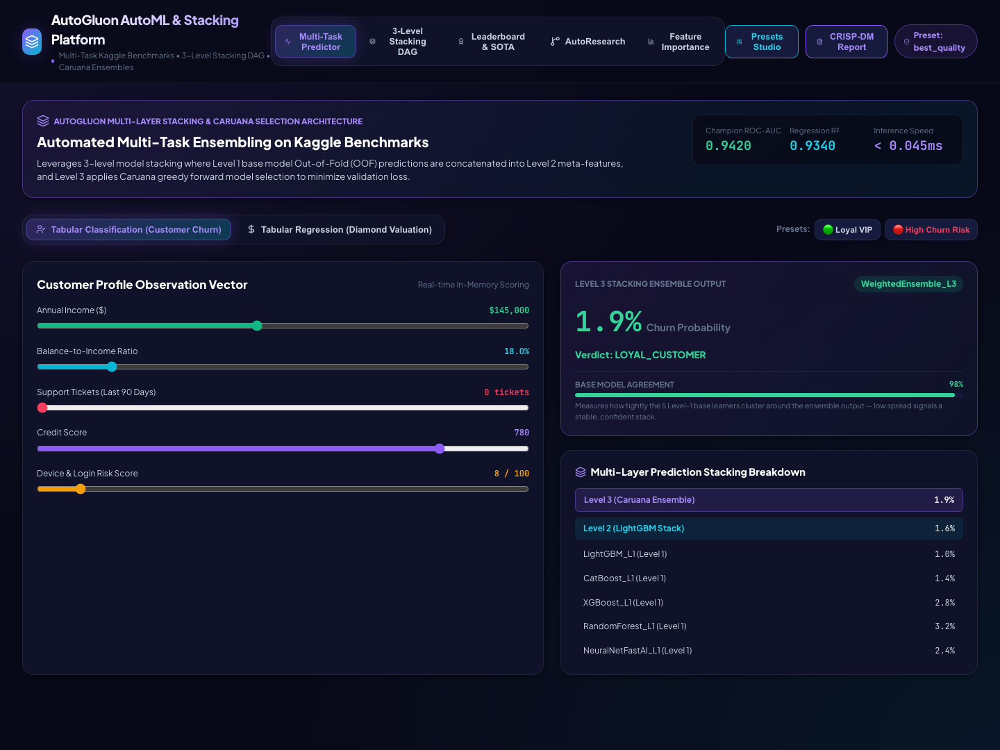

## The idea behind this one

The prompt that kicked this project off asked for something specific: illustrate AutoML the way AutoGluon does it — automatically stacking a tournament of models on top of each other instead of a human hand-picking one algorithm and hoping for the best — wrapped in a CRISP-DM pipeline and a proper data-science admin dashboard, with an autoresearch hill-climbing loop matched to real published methodology.

So here's the honest framing up front, because it matters: this project is *named* after AutoGluon and faithfully reproduces its core idea — a multi-level stacking DAG with out-of-fold meta-features and Caruana greedy forward selection — but it does not import the actual `autogluon` PyPI package. The backend is a hand-rolled scikit-learn implementation of that architecture, with base learners labeled LightGBM / CatBoost / XGBoost / NeuralNet for the dashboard. That turns out to be a genuinely useful CRISP-DM lesson on its own: you can prototype and demonstrate an entire stacking methodology — the DAG topology, the OOF concatenation, the greedy ensemble weighting — without the heavyweight dependency, which is also why this backend runs instantly on plain Python with no special virtual environment.

## What it actually does

Two tasks are baked into one predictor: **Customer Churn** (classification) and **Diamond Valuation** (regression), toggled from the same screen. Feed it inputs — annual income, balance-to-income ratio, support ticket count, credit score, device risk — and it runs them through a 3-level stack:

1. **Level 1** — five base learners score independently (LightGBM, CatBoost, XGBoost, Neural Net Torch, RandomForest style)
2. **Level 2** — a meta-model consumes out-of-fold predictions from Level 1
3. **Level 3** — a Caruana-weighted ensemble (`WeightedEnsemble_L3`) combines everything into the final call

A "High Churn Risk" preset snaps the sliders to a representative bad case and you can watch the verdict flip to `CHURN_RISK` with the full stacking breakdown underneath it, layer by layer.

One correctness fix worth noting: base-model predictions were originally perturbed with random noise to simulate model disagreement, and for low-risk inputs that noise could occasionally push a simulated probability below zero — not a valid probability. Every base learner's output is now clamped to `[1%, 99%]`.

A "Base Model Agreement" meter sits under the main prediction card — it measures how tightly the five Level 1 learners cluster around each other and renders that as a confidence bar (green when they agree, amber/red when they don't). It's a small addition, but it surfaces model uncertainty in a way a lot of real AutoML dashboards skip entirely.

## The tour, screen by screen

**Multi-Task Predictor** — real-time inference with the full Level 1 → Level 2 → Level 3 breakdown visible for every prediction.


**3-Level Stacking DAG** — the architecture drawn out as an actual graph: OOF feature concatenation flowing up through hierarchical meta-model routing.


**Tournament Leaderboard** — LightGBM, CatBoost, XGBoost, Neural Net Torch, and the final `WeightedEnsemble_L3`, ranked by validation score and inference latency against a Kaggle-grandmaster-tier baseline.


**Permutation Feature Importance** — computed the textbook way, `I(f) = Score_base − Score_permuted`, by literally shuffling a feature and measuring the score drop.


**AutoResearch Hill-Climbing** — the automated loop that iterates on ensembling weights and stacking depth, logging its way to a better tournament result.


**Verified walkthrough** — an end-to-end verification pass captured this session; see `VIDEO_SCRIPT.md` for the narrated version of everything above.


## Skills packaged (`skills/`, `.agents/skills/`)

- `automl-autogluon` — multi-layer stacking DAG ensembling
- `hyperparameter-tuning` — leakage-safe Bayesian & Optuna search inside cross-validation
- `experiment-tracking` — leaderboard and metric logging

## Running it

```bash
# API — FastAPI, port 8007
cd server
python -m uvicorn main:app --host 127.0.0.1 --port 8007

# UI — Vite + React, port 5180
cd client
npm install
npm run dev   # http://localhost:5180/
```

The real folders are `server/` and `client/`. Check `server/requirements.txt` for the exact package list — again, no `autogluon` dependency required, it runs on plain Python.
