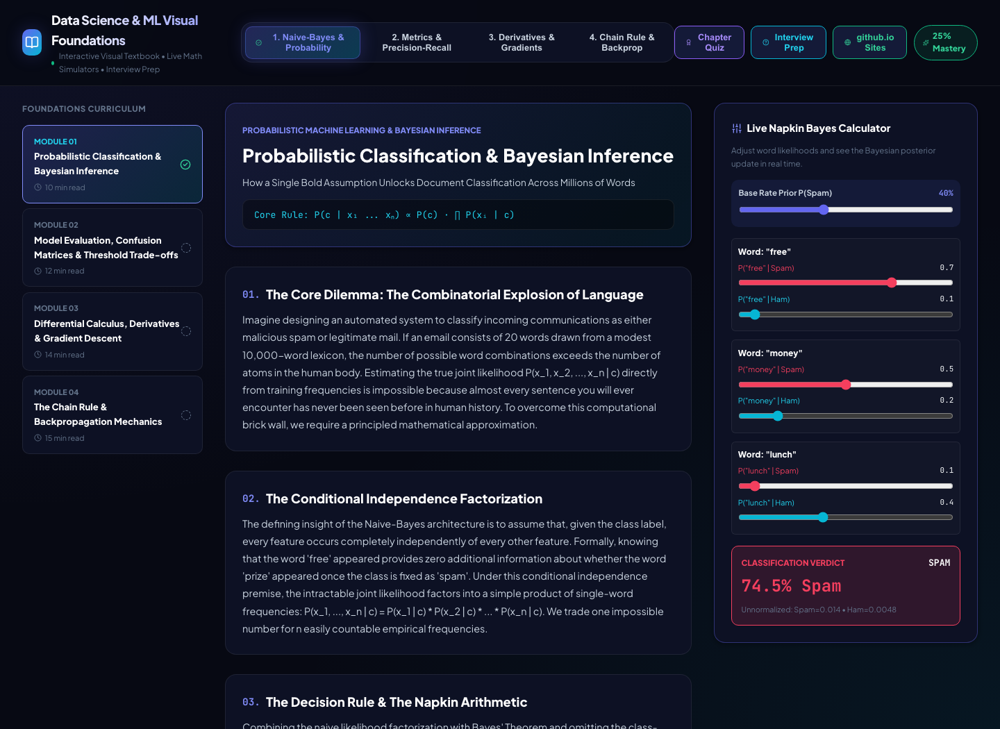

# Syllabus — Data Science & ML Visual Foundations

An interactive textbook built for one purpose: teach four of the most misunderstood foundational concepts in machine learning by letting students drag sliders and watch the math move, rather than memorizing formulas cold. Built from a single prompt asking for "deep intuition and rigorous math and visual intuition and live simulation" across four topics, plus quizzes, interview prep, and a GitHub Pages-ready build.

Course sidebar tracks a per-module read-time estimate, a completion checkmark, and an overall mastery progress bar across the four modules below.

---

### Module 1 — Probabilistic Classification: Live Napkin Bayes
**Concept:** why naive Bayes works despite its "naive" conditional-independence assumption, and how it sidesteps the combinatorial explosion of estimating a full joint distribution.
**Simulator:** drag priors and likelihoods for a word like "free" appearing in spam vs. ham, and watch the posterior probability recompute instantly.
**Screenshot:**


### Module 2 — Model Evaluation: Confusion Matrices, PR Curves, and Cost
**Concept:** confusion matrices, Type I/II errors, ROC-AUC, and the precision/recall tradeoff — plus the piece plain metrics leave out: a false positive and a false negative are rarely equally expensive in the real world.
**Simulator:** a classification threshold slider updates the confusion matrix and precision/recall/F1 live. Layered on top: a **cost-sensitive decision matrix** — separate cost-per-false-positive and cost-per-false-negative sliders feeding a running total-expected-cost readout. Crank up the false-negative cost (think cancer screening, where a missed positive is catastrophic) and watch the optimal threshold get pulled down to trade false alarms for fewer missed cases.
**Screenshot:**


### Module 3 — Differential Calculus: Derivatives and Gradient Descent
**Concept:** what a derivative actually is (the slope of a tangent line), and how repeatedly following that slope downhill is gradient descent.
**Simulator:** a tangent-slope visualizer that feeds directly into a steppable gradient-descent simulator.
**Screenshot:**


### Module 4 — Chain Rule and Backpropagation
**Concept:** how the chain rule, applied link by link through a computational graph, is exactly what backpropagation is doing under the hood.
**Simulator:** a forward-pass / backward-pass walkthrough you can step through node by node.
**Screenshot:**


---

### Assessment

**Chapter Quiz** — multi-question conceptual checks after each module, with immediate explanation feedback rather than a bare right/wrong.


**Interview Prep Deck** — a flashcard deck of high-yield data science interview questions covering the theory across all four modules.


**Verified walkthrough** — a full end-to-end pass through the course captured this session; see `VIDEO_SCRIPT.md` for the narrated version.


---

### Course materials packaged as skills (`skills/`, `.agents/skills/`)

- `data-science-mastery` — foundational curriculum builder
- `visualization-builder` — the dynamic visual-math simulator components powering each module
- `reproducible-ml` — deterministic mathematical proof implementations behind the simulators

### Also in this repo

A static, GitHub Pages-ready export lives in `static_gh_pages/`, and the course content source is under `content/` — useful if you want to read the module text directly rather than through the UI.

---

### Enrollment (i.e., running it locally)

```bash
# Server — FastAPI, port 8008
cd server
pip install -r requirements.txt
python -m uvicorn main:app --host 127.0.0.1 --port 8008

# Client — Vite + React, port 5181
cd client
npm install
npm run dev   # http://localhost:5181/
```
