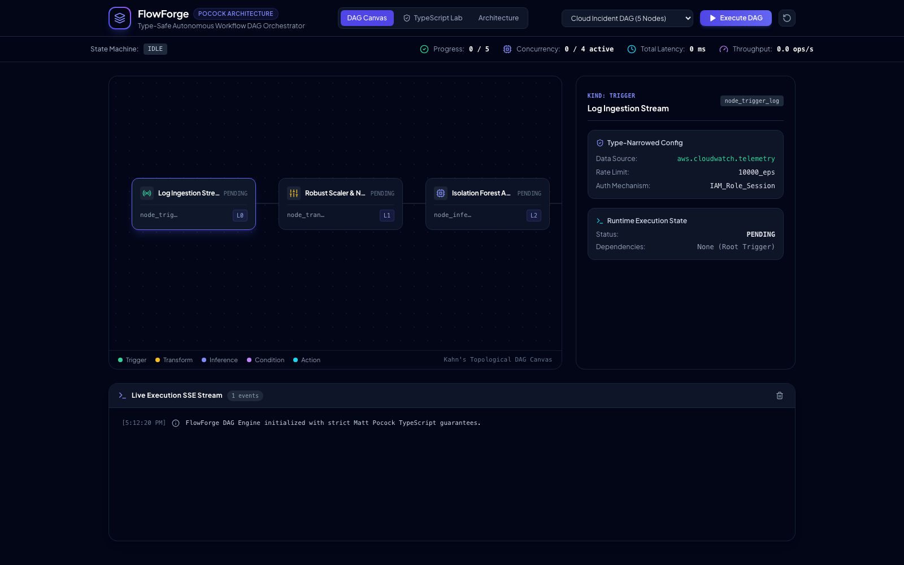

## FlowForge

Open the app and you land straight in the DAG Canvas with a default "Cloud Incident Response" workflow already wired up: a log-ingestion trigger → a robust-scaler transform → an isolation-forest anomaly model → a severity condition branch → a remediation action. Every node card is color-coded by kind (`trigger`, `transform`, `inference`, `condition`, `action`, `join`), and each one carries an `L0`/`L1`/`L2` badge — the topological concurrency level, computed client-side straight from Kahn's algorithm, so you can tell at a glance which nodes are independent and could run in parallel versus which ones are strictly sequential.

Hit **Execute DAG** in the top right and the engine walks a real finite-state machine — `idle → validating → compiling → running → completed` — animating live in the metrics bar. Server-side, the FastAPI backend runs Kahn's in-degree algorithm to detect cycles and compute concurrency stages, then streams every state transition and node execution over Server-Sent Events down to a running terminal at the bottom of the screen, each line carrying a simulated latency and a synthetic output payload. If the in-degree counts never all reach zero — a cycle — the compile step fails with an error naming exactly which nodes are stuck. That's not decorative; it's Kahn's algorithm doing the actual cycle check.

Two more tabs round it out: a **TypeScript Lab** with the branded-type and discriminated-union code patterns laid out and explained, and an **Architecture** doc covering the three pillars — cycle detection, concurrency staging, and the SSE event bus.

Where this came from: the build prompt was one line — *"install matt pocock skills and then demonstrate it with a complicated end2end full stack project."* Matt Pocock is a well-known TypeScript educator (branded types, discriminated unions, exhaustive pattern matching), so the brief was to take those type-safety patterns out of toy-snippet territory and prove them out in something that actually runs.

### What's actually type-safe here

- **Nominal branded types** — `type WorkflowId = string & { readonly __brand: unique symbol }` and the same pattern for `NodeId`, preventing accidental ID mixups at compile time
- **Discriminated unions** — six strongly typed node schemas (`trigger`, `transform`, `inference`, `condition`, `action`, `join`)
- **Compile-time exhaustiveness** — `assertNever(x: never): never` turns an unhandled case into a compiler error, not a runtime surprise
- **Kahn's topological sort** — `O(V + E)` in-degree resolution, used for both concurrency staging and cycle detection

### Screens

| | |
|---|---|
|  | **DAG Canvas** — the topological editor: execution levels, concurrency slots, live state machine transitions. |
|  | **TypeScript Lab** — branded types, discriminated unions, and exhaustiveness narrowing, with runnable examples. |
|  | **SSE Live Telemetry** — the sub-second event stream: node executions, latency, topological progress. |
|  | **Verified walkthrough** — end-to-end pass captured this session; narrated version in `VIDEO_SCRIPT.md`. |

### Skills packaged (`skills/`, `.agents/skills/`)

- `matt-pocock-typescript-patterns` — type narrowing, branded types, discriminated unions
- `matt-pocock-to-spec` — formal type-driven technical specifications
- `matt-pocock-to-tickets` — tracer-bullet, independently verifiable engineering tickets
- `matt-pocock-grill-me` — rigorous requirements and edge-case interrogation

### Further reading in this repo

`ARCHITECTURE.md` and `SPECIFICATION.md` go deeper on the design; `TICKETS.md` has the engineering breakdown the `matt-pocock-to-tickets` skill produced.

### Run it

```bash
# Backend — FastAPI, port 8009
cd backend
python -m uvicorn main:app --host 127.0.0.1 --port 8009

# Frontend — Vite + React, port 5182
cd frontend
npm install
npm run dev   # http://localhost:5182/
```
